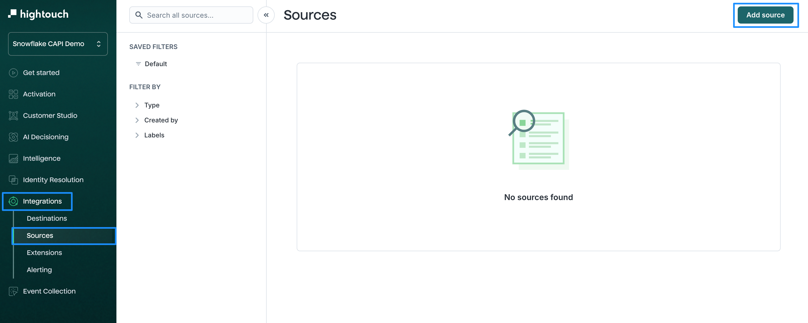
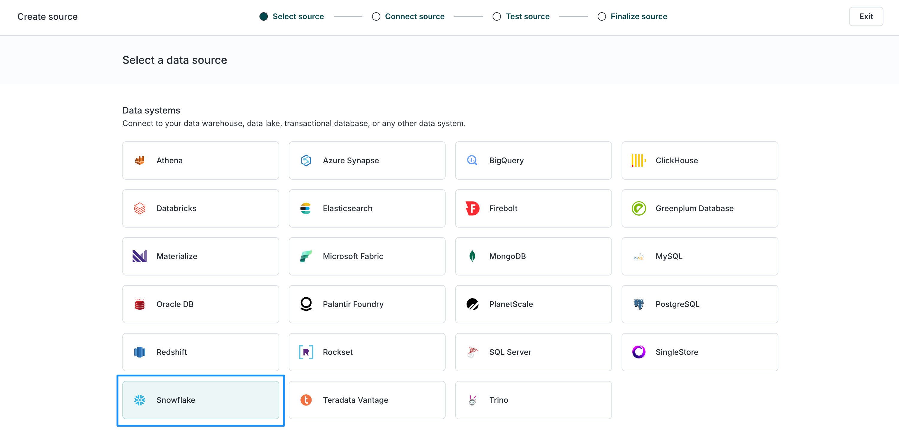
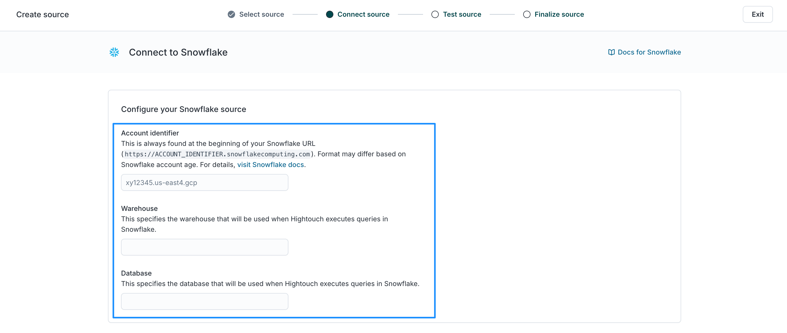
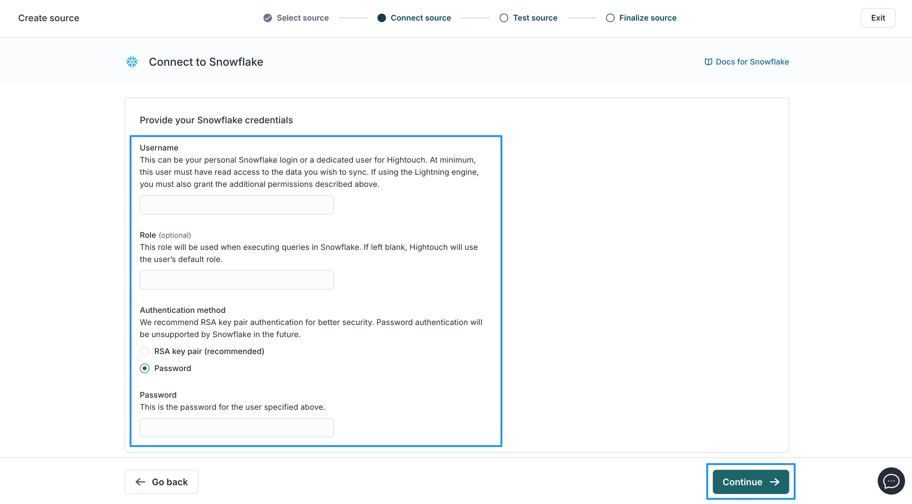
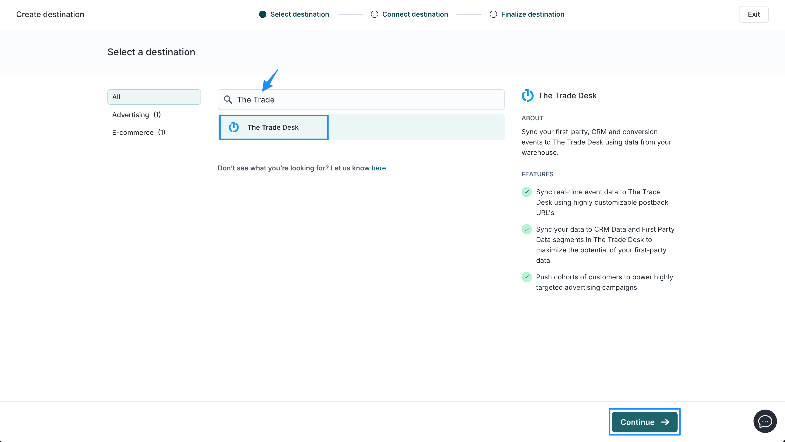
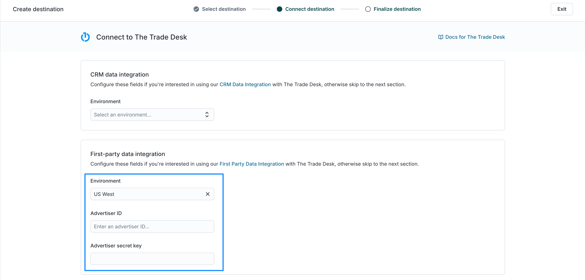
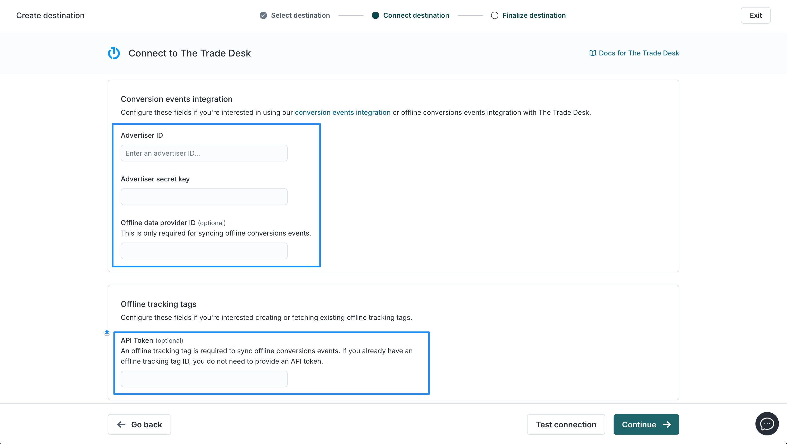

author: Ian Maier
id: build_an_offsite_commerce_media_network_on_snowflake
summary: Build a commerce media platform for audience curation, offsite activation, and closed-loop measurement.
<!--- Categories below should be hyphenated, i.e., Getting-Started. Do not leave blank. Visit site for available categories. -->
categories: Marketing
environments: dais <!--- What is the correct environment for the DAIS hands-on lab? -->
status: Draft
feedback link: https://github.com/Snowflake-Labs/sfguides/issues
tags: Marketing, Partners, Media, Hightouch, Retail, Commerce

# Build an Offsite Commerce Media Network on Snowflake with Hightouch & The Trade Desk
<!-- ------------------------ -->
## Overview 
Duration: 1

In this guide you will learn how to transform your existing Snowflake investment into a user-friendly platform that a non-technical commerce media team can use to curate custom audiences, activate and share them with their advertising partners, and provide closed-loop attribution.

### Business Scenario
We are building a Travel Media Network for a global luxury hospitality conglomerate called Altuva, which owns multiple hotel brands with millions of  visitors annually. We are partnering with a high-end Consumer Packaged Goods company called Omnira, which sells luxury snacks, beverages, and health & wellness amenities within most of Altuva's hotels. Omnira has approached us with a specific campaign request: they want to promote their products to Altuva's hotel visitors in the 30 days before their arrival to influence more in-hotel consumption.

Our task is to build a platform that our non-techincal media team can use to create a highly customized audience, share the audience with Omnira, and provide Omnira with attribution reports to help them understand how well their ads drive in-hotel purchases.

### Prerequisites
- N/A

### What You’ll Learn 
- How to enrich Snowflake with UID2s using the Snowflake Native App for privacy-safe activation and measurement.
- How to build a visual audience builder on top of Snowflake using Hightouch.
- How to activate audiences on The Trade Desk using Hightouch, for both managed service and self-service campaign execution.
- How to send offline conversion events from Snowflake to The Trade Desk using Hightouch.
- How to execute The Trade Desk campaigns using shared audiences and conversion events.
- How to build SKU-level attribution reporting on Snowflake using The Trade Desk's Raw Event Data Stream (REDS). 

### What You’ll Need 
- A Snowflake account login with a role that has the permissions to create a new database, schema, and warehouse to be used by Hightouch. Account details will be provided to you for the live hands-on lab at Snowflake Summit.
- A Hightouch account with Customer Studio access. An account with temporary product access will be provided to you for the live hands-on lab at Snowflake Summit.

### What You’ll Build 
- A Snowflake-native visual audience builder customized to your luxury hospitality brand's unique data & offering.
- An activation platform for syndicating audiences and conversion events to The Trade Desk.
- Closed-loop attribution reporting with SKU-level breakdowns.

<!-- ------------------------ -->
## Enrich the Snowflake Customers table with UID2
Duration: 1

These instructions provide basic setup details for this hands-on lab. Implementation for your business may vary based on your unique data, use cases, and requirements. For detailed implementation instructions, visit the [UID2 Snowflake Integration Guide &rarr;](https://unifiedid.com/docs/guides/integration-snowflake)

The UID2 Snowflake Native App provides a simplified and seamless process for matching your customer identifiers (e.g. emails and phone numbers) to a pseudonymous identifier that can be used for ad targeting and conversion across publishers supported by The Trade Desk. Unlike directly identifying information, UID2 cannot by itself be traced back to the customer's original identity.

### How it works
The UID2 Snowflake Native App allows you to enrich your customer tables with UID2 data through authorized functions and views so that you can join UID2 data from the private tables to your customers' emails and phone numbers. You can’t access the private tables directly. The UID2 Share reveals only essential data needed to perform the UID2 enrichment tasks.


### Access the UID2 Share
To request access to the UID2 Share, complete the following steps:

1. Log in to the Snowflake Data Marketplace and select the UID2 listing:
    [Unified ID 2.0: Advertiser and Data Provider Identity Solution](https://app.snowflake.com/marketplace/listing/GZT0ZRYXTN8/unified-id-2-0-unified-id-2-0-advertiser-and-data-provider-identity-solution)
2. In the **Personalized Data** section, click **Request Data**.
3. Follow the onscreen instructions to verify and provide your contact details and other required information.
4. If you are an existing client of The Trade Desk, include your partner and advertiser IDs issued by The Trade Desk in the **Message** field of the data request form.
5. Submit the form.

After your request is received, a UID2 administrator will contact you with the appropriate access instructions. For details about managing data requests in Snowflake, see the [Snowflake documentation](https://docs.snowflake.com/en/user-guide/data-marketplace-consumer.html).

### Join UID data to your customer table

To map UID2 to emails and phone numbers in your customer table, use the `FN_T_IDENTITY_MAP` function.

```sql
select a.ID, a.EMAIL, m.UID, m.BUCKET_ID, m.UNMAPPED
from HOL_CMN.PUBLIC.CUSTOMERS a
LEFT JOIN(
  select ID, t.*
  from HOL_CMN.PUBLIC.CUSTOMERS, lateral UID2_PROD_UID_SH.UID.FN_T_IDENTITY_MAP(EMAIL, 'email') t) m
on a.ID=m.ID;
}
```

### Normalization

**Email Normalization**: The function accepts raw and hashed emails. If the identifier is an email address, the service normalizes the data using the [UID2 Email Address Normalization](https://unifiedid.com/docs/getting-started/gs-normalization-encoding#email-address-normalization) rules.

**Phone Normalization**: The function accepts raw and hashed phone numbers. If the identifier is a phone number, you must normalize it before sending it to the service, using the [UID2 Phone Number Normalization](https://unifiedid.com/docs/getting-started/gs-normalization-encoding#phone-number-normalization) rules.

<!-- ------------------------ -->
## Connect Hightouch to Snowflake
Duration: 1

Hightouch transforms Snowflake into a customer data platform (CDP), giving your commerce media team the ability to curate customer audiences, activate them for onsite and offsite targeting, and provide attribution and incrementality reporting without the need for engineering support. As the leading Snowflake-native CDP, Hightouch does not copy and store your data in its own infrastructure, ensuring that Snowflake remains your single source of truth and that your customer data remains private and secure. 


To connect Hightouch to Snowflake:
1. [Log in](https://app.hightouch.com/login) to your Hightouch account.
2. Navigate to **Integrations > Sources** and click **Add Source**.
  
3. Select **Snowflake** in the **Data systems** section.
  
4. Provide the following configuration values in the **Configure your Snowflake source** section:
    - **Account identifier**: TBD
    - **Warehouse**: TBD
    - **Database**: TBD
  
5. Scroll down and provide the following Snowflake credentials to authenticate and click **Continue**.
    - **Username**: TBD
    - **Role**: TBD
    - **Authentication method**: Password
    - **Password**: TBD
  
6. Name your data source "Snowflake - Altuva" and click **Finish**.

<!-- ------------------------ -->
## Connect Hightouch to The Trade Desk
Duration: 1

Next, we will connect Hightouch to The Trade Desk so that you can sync audiences and conversion events from Snowflake to the ad platform.

### Create a Trade Desk destination
To push data to The Trade Desk, you need to create a destination.

Hightouch offers integrations with a number of different audience and conversion endpoints with The Trade Desk, including first-party audiences, CRM audiences, and third-party audiences that allow you to list them on the 3rd party data marketplace.

In this guide, we will connect to The Trade Desk using the first-party endpoints. Once the audiences and conversion events are synced to The Trade Desk, we will have to option of executing campaigns from our own advertising account (e.g., for managed services) or share the audience with our advertising partner's account (e.g., for self-service).

To connect The Trade Desk destination:
1. Navigate to **Integrations > Destinations** and click **Add Destination**.
    
3. Search for **The Trade Desk**, select it, and click **Continue**.
    
4. Scroll down to the **First-Party Data Segment** section. Input the following values in the config:
    - **Environment**: US West
    - **Advertiser ID**
    - **Advertiser secret key**
    
5. Scroll down further to the **Conversion event integration** section. Input the following values in the config:
    - **Advertiser ID**
    - **Advertiser secret key**
    - **Offline data provider ID**
    - **Offline tracking tag API token**
    
6. Name the destination "The Trade Desk - Altuva" and click **Finish** to create the destination.

<!-- ------------------------ -->
## Build the audience schema
Duration: 1

Data schemas define how data is structured, including the data types (like users, events, accounts, and households) and relationships between those data types. If you think of your data warehouse like an actual house, your data schema is the blueprint. Just like a blueprint outlines the structure of a house—where the rooms are and how they connect—a data schema defines how your data is organized and how different parts of your data relate to one another.

For our Travel Media Network at Altuva, there are three data types we need to represent in our schema using a Snowflake table:
1. **Customers** - Information about our customers, including their identity and loyalty membership status.
2. **Hotel Visits** - Information about past, present, and future hotel visits, including when and where our customers are visiting our hotels.
3. **Purchase Events** - Past and present amenities purchased in our hotels.


### Create a Customer parent model
Parent models define the primary dataset you want to build your audiences off. In this guide, we will create a Customers table that represents all Altuva Brands customers who have visited a hotel and/or signed up as a loyalty member.

To create a [parent model](https://hightouch.com/docs/customer-studio/schema#parent-model-setup) for Altuva use the following steps:
1. Go to the [Schema page](https://app.hightouch.com/schema-v2/view).
2. Select your Snowflake data source from Step 5 by selecting it from the dropdown.
3. Click **Create parent model**.
4. Select the **Customers** table from the Altuva database.

By default, Hightouch prompts you to select a table in your source. If you prefer to use a custom SQL query, dbt model, or another modeling method to define your own model, you can change it from the modeling method dropdown.
5. Select the **CUSTOMERS** table, preview the results, and click **Continue**.
6. Enter a **name** for your parent model. In this example, use “Customers”.
7. Select a **primary key**. You must select a column with unique values. In this example, use **CUSTOMER_ID** for the primary key.
8. Select columns for the model's **primary label** and **secondary label**. Hightouch displays these column values when previewing audiences. In this example, we will use **FIRST_NAME** as the primary label and **LAST_NAME** as the secondary label.
9. Click **Create parent model**.

The parent model now appears in the schema builder. You can edit an existing parent model by clicking on it and making changes in the Query tab. For more configuration options, refer to the [column configuration](https://hightouch.com/docs/customer-studio/schema#column-configuration) section.

### Create Hotel Visits related model
Related models and events provide additional characteristics or actions on which you can filter your parent model. When you create a related model, you simultaneously set up the relationship between it and other objects in the schema.

For our Travel Media Network we will create a related model for Hotel Visits so that we can build audiences based on past or upcoming visits to certain hotels. This model will have a 1:Many relationship between Customers and Hotel Visits since an individual customer can make multiple hotel visits.


1. Click the **+** button on the **Customers parent model** that you created before and select **Create a related model**.
2. Select the **HOTEL_VISITS** table using the table selector and click **Continue**.
4. Enter a **name** for your related model. In this example, name it “Hotel Visits”.
5. Define the related model's **Relationship**. In this example, select the relationship's cardinality as **1:Many**.
6. To join rows from the related model to rows in the parent model, select the relevant **foreign key columns** from the parent (Customers) and related model (Hotel Visits). In this example, select **Customer_ID** as the foreign key for both models.
8. Click **Create related model**.

The related model now appears in the schema builder. You can edit an existing related model by clicking on it and making changes in the Query tab.

### Create a Purchases event model
Event definition is a one-time step similar to related model setup. The only difference is that event models require a timestamp column.

In this example, we will create an event model for **Purchases**. These events will be used to exclude members who made a recent purchase from our advertising customers, allowing them to focus on reaching net-new customers.


1. Click the **+** button on the **Customers parent model** and select **Create a related event**.
2. Select the **PURCHASES** table, preview the results, and click **Continue**.
3. Enter a **name** for your event model. For this example, use "Purchases".
4. Set the appropriate **Timestamp** field to define when the event occurred. In this example, select **PURCHASE_DATE**.
5. Keep the **Event type** set to **Generic**.
6. Set the **Primary key** to **PURCHASE_ID**.
7. Enable **Column Suggestions** to make it easier to find column values when building audiences.
8. Define the related event's **Relationship**. Select the relationship's cardinality **1:Many**, because every individual Customer can make multiple Purchases.
9. Click **Create event**.

The **Purchases** event model will now appear in the schema builder. You can edit an existing event model by clicking on it and making changes in the **Query** tab.

Now that your Schema has been defined, we can use the point-and-click audience builder to create custom audiences for your advertising partners using data about your customers, their hotel visits, and past purchases.

<!-- ------------------------ -->
## Create a custom audience for monetization
Duration: 1

Now that we've built the audience schema, we can use Hightouch's audience builder to create a custom audience for our advertising partner's upcoming campaign.

Omnira wants to run an influence campaign to encourage Altuva visitors to buy more of their products when they visit Altuva hotels. But they want to carefully segment the audience to ensure the campaign is as effective as possible:
- Target customers with a visit coming up in the next 30 days
- Target members with Platinum or Diamond loyalty tiers to promote a discount offer 
- Exclude visitors of the Cavara Residences, since they don’t offer their products at that hotel brand
- Exclude recent purchasers

For most CDPs and audience managers, this audience would be too complex to build without the help of data engineering since the platforms don't support concepts like "hotel visits". But with the customized schema we built using our Snowflake data, a business user in Hightouch can build this audience in a few minutes without technical limitations.

### Build a custom audience on Snowflake
To build the audience:
1. Go to **Customer Studio > Audience** and click **Add audience**.
2. Select the **Customers parent model**.
3. Build the audience to match the definition here:


1. Select **Add filter** and choose **Customers > MEMBERSHIP_LEVEL**. Select **Platinum** and **Diamond**.
2. Select **Add filter** and choose **Relations > Hotel Visits**. 
3. Select **Where event property is** and choose the **CHECK_IN_DATE** field, and select **within next 1 months**.
4. Select **Where event property is** again and choose the **HOTEL_BRAND** field. Click the **equals** box and change the logic to **does not equal** **Cavara Residences**.
5. Select **Add filter** and choose **Events > Purchases**.
6. Click on the filter that says **at least 1 time** and change the frequency to **at most 0 times**.
7. Select the **Time window filter** on the **Purchase event** and change the filter to **within the previous 1 year**.
8. Select **Add filter** and choose **Relations > Memberships**.
10. Scroll back to the top and click **Calculate size** to get an estimate of the number of customers in the audience.
11. Click **Continue** at the bottom. Name the audience “Upcoming Visitors - Omnira” and click **Finish** to save the audience.

<!-- ------------------------ -->
## Sync the audience to The Trade Desk
Duration: 1

Now we will sync the audience that we created to The Trade Desk for targeting. For managed services, the audience can be used immediately in campaigns from Altuva’s Trade Desk seat. For self-service, we will share the audience to Omnira's seat in a following step.

### Configure The Trade Desk first-party data segment sync
1. Click **Add sync** from the Upcoming Visitors - Omnira audience page.
2. Select **First-party data segment**. This will allow you to create, sync, and refresh a first-party audience to The Trade Desk using UID2 as the match key.
3. Keep the **create new segment** setting on and leave the **segment name** blank. The sync will automatically inherit the audience name, “Upcoming Visitors - Omnira”.
4. Select the **UID2** field from your Snowflake Customers table. Make sure it is mapped to the **Unified ID 2.0 (UID2)** field from The Trade Desk. Click **Continue**.
5. Set the **Schedule Type** to **Manual**. In a live environment, we would set the schedule on an interval to refresh daily so that Hightouch automatically adds and removes the appropriate users daily, ensuring your audience is always fresh and complies with opt-out requests.
6. Click **Finish**.

### Run and observe the sync
1. To run the sync manually, click **Run Sync**.
2. To observe the status of the sync run, click on the **processing** sync under **Recent sync runs**.

The Run Summary page provides granular insight into the status and speed of the data being queried on Snowflake and synced to The Trade Desk. This level of observability helps your team easily monitor, diagnose, and fix any issues with slow or failed audience updates. You also have the option to set up alerting so that your team can proactively identify and fix issues.

<!-- ------------------------ -->
## Share the audience with the advertising partner
Duration: 1

Now that your audience has been synced to your The Trade Desk seat, there are two ways you can enable your advertising partners to run their campaigns:
1. **Managed Service**: Run campaigns for your advertising partner. This gives you full control over how your brand is represented and how ads are served, but it comes with higher operational costs.
2. **Self-Service**: Share the audience with your advertising partner so that they can run campaigns themselves. This option gives you less control, but is less expensive to manage and is easier for the advertiser.

In this example, we want to enable Omnira to run self-service campaigns from their own The Trade Desk seat.

To do this, we will use The Trade Desk's platform-native audience sharing features to share our audience with Omnira in a privacy-safe way:
1. STEP
2. STEP
3. STEP

<!-- ------------------------ -->
## Advertiser: Run a self-service campaign
Duration: 1

Now that Omnira has access to the audience, they can select and target that audience in campaigns that they control from their own advertising seat. When the campaign ends, Altuva can remove access to the audience.

To select and use the shared audience in a campaign:
1. STEP
2. STEP
3. STEP

<!-- ------------------------ -->
## Create, sync, and share brand-specific conversion events
Duration: 1

Now that Omnira is actively targeting hotel visits with targeted ads, they want to track the success of their campaign in The Trade Desk by syncing conversion events to their advertising seat. However, the purchases happen through Altuva meaning that they do not have direct access to conversion data.

In order to get access to conversions, we will need to create and share conversion data with Omnira in a way where:only Omnira purchases are shared and Altuva's customer data is kept private and secure.

To do this, we will:
1. Create a brand-specific conversion model
2. Sync the conversion data to Altuva's advertising seat using UID2 for privacy-safe matching
3. Securely share the conversion event feed to Omnira's seat using The Trade Desk's data sharing capabilities

Let's start with creating a brand-specific conversion model...

<!-- ------------------------ -->
## Create a brand-specific conversion model
Duration: 1

<!-- ------------------------ -->
## Create an Offline Conversion Sync to The Trade Desk
Duration: 1

<!-- ------------------------ -->
## Share and use conversion data in a campaign
Duration: 1

Now that Omnira's conversion events are being privately and securely synced to Altuva's advertising seat, we can share that conversion event data with Omnira to use for self-service campaign optimization and reporting.

### Share offline conversion data with your advertising partner

Measurement marketplace providers can make an offline measurement offering available to buyers. In the platform UI, information for your data as a provider is listed in a tile on the Measurement Marketplace page under Reports. For details, see [Measurement Marketplace](https://desk.thetradedesk.com/knowledge-portal/en/measurement-set-up.html) and [Measurement Marketplace Partners](https://desk.thetradedesk.com/knowledge-portal/en/measurement-partners.html) in the Knowledge Portal.

To get started as an offline data provider, contact The Trade Desk Data Partnerships team.


To share conversion data with an advertising partner:
1. STEP
2. STEP
3. STEP

### Advertiser: Use offline conversion data in a campaign

Now that the conversion data has been shared with Omnira, they can use the data for campaign optimization and reporting in their self-service campaign.

Conversion events can be found within The Trade Desk by navigating to the **Advertiser Data & Identity** tile.

### Use the shared conversion data feed in a campaign
Conversion Pixels can be found within the TTD Advertiser Data & Identity tile. Once once you can see conversion events surface through each event tag, you can apply those tags to a campaign through the TTD Audience Builder tile.


<!-- ------------------------ -->
## (Bonus) Set up REDS data sync
Duration: 1

<!-- ------------------------ -->
## (Bonus) Create an attribution report
Duration: 1

<!-- ------------------------ -->
## Conclusion
Duration: 0


<!-- ------------------------ -->
## Code Snippets, Info Boxes, and Tables
Duration: 2

Look at the [markdown source for this sfguide](https://raw.githubusercontent.com/Snowflake-Labs/sfguides/master/site/sfguides/sample.md) to see how to use markdown to generate code snippets, info boxes, and download buttons. 

### JavaScript
```javascript
{ 
  key1: "string", 
  key2: integer,
  key3: "string"
}
```

### Java
```java
for (statement 1; statement 2; statement 3) {
  // code block to be executed
}
```

### Info Boxes
> aside positive
> 
>  This will appear in a positive info box.


> aside negative
> 
>  This will appear in a negative info box.

### Buttons
<button>

  [This is a download button](link.com)
</button>

### Tables
<table>
    <thead>
        <tr>
            <th colspan="2"> **The table header** </th>
        </tr>
    </thead>
    <tbody>
        <tr>
            <td>The table body</td>
            <td>with two columns</td>
        </tr>
    </tbody>
</table>

### Hyperlinking
[Youtube - Halsey Playlists](https://www.youtube.com/user/iamhalsey/playlists)

<!-- ------------------------ -->
## Images, Videos, and Surveys, and iFrames
Duration: 2

Look at the [markdown source for this guide](https://raw.githubusercontent.com/Snowflake-Labs/sfguides/master/site/sfguides/sample.md) to see how to use markdown to generate these elements. 

### Images


### Videos
Videos from youtube can be directly embedded:
<video id="KmeiFXrZucE"></video>

### Inline Surveys
<form>
  <name>How do you rate yourself as a user of Snowflake?</name>
  <input type="radio" value="Beginner">
  <input type="radio" value="Intermediate">
  <input type="radio" value="Advanced">
</form>

### Embed an iframe


<!-- ------------------------ -->
## Conclusion
Duration: 1

At the end of your Snowflake Guide, always have a clear call to action (CTA). This CTA could be a link to the docs pages, links to videos on youtube, a GitHub repo link, etc. 

If you want to learn more about Snowflake Guide formatting, checkout the official documentation here: [Formatting Guide](https://github.com/googlecodelabs/tools/blob/master/FORMAT-GUIDE.md)

### What we've covered
- creating steps and setting duration
- adding code snippets
- embedding images, videos, and surveys
- importing other markdown files
