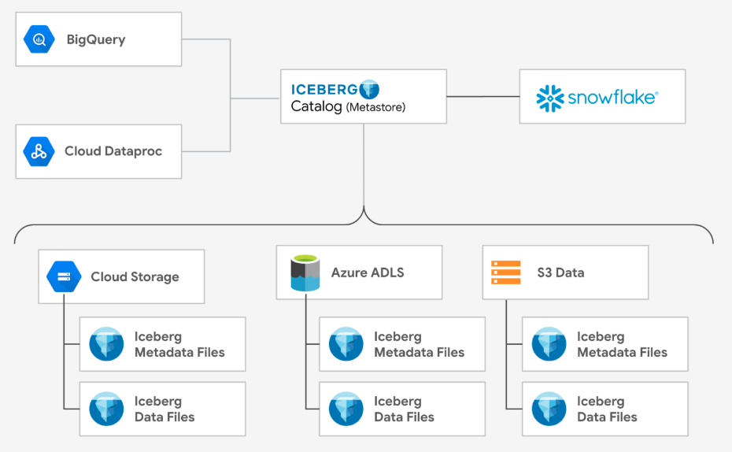

author: Matt Marzillo
id: sharing_data_between_bigquery_and_snowflake_using_apache_iceberg
summary: This is a quickstart showing users how use iceberg with Snowflake and Big Query
categories: Data-Sharing, GCP, Iceberg, Big Query, Google, Open, Open Table Format
environments: web
status: Published 
feedback link: https://github.com/Snowflake-Labs/sfguides/issues
tags: iceberg, google, gcp, bigquery, open

# Using Snowflake Cortex And Streamlit With Geospatial Data
<!-- ------------------------ -->
## Overview 
Duration: 10

Apache Iceberg has become a very popular open-source table format for data lakes as its flexibility enables freedom of choice for organizations. Whether an organization wants to use best of breed services or they’ve inherited multiple data platforms due to mergers or acquisitions, adopting an open table format could be key to eliminating data silos.

### Use Case
There is often no one-size-fits-all approach to tackling complex business challenges. Organizations often store their data in different places and use multiple tools and platforms to put that data to work. By uniting data across platforms and query engines using an open table format, organizations can serve a variety of business needs, including: 
- Modernizing their data lake
- Enabling data interoperability and a joint data mesh architecture
- Building batch or streaming data pipelines
- Building transformation and change data capture (CDC) pipelines
- Serving analytics-ready data to business teams


### Prerequisites
- Familiarity with [Snowflake](https://quickstarts.snowflake.com/guide/getting_started_with_snowflake/index.html#0) and a Snowflake account
- Familiarity with [Google Cloud](https://cloud.google.com/free) and a Google Cloud account.

### What You’ll Learn
- Creating a Snowflake Managed Iceberg table and then have BigQuery read the table
- Creating a BigLake Managed table and then have Snowflake read the table
- Keeping BigQuery in-sync with Iceberg tables hosted on Snowflake



### What You’ll Need
- [Snowflake account](https://signup.snowflake.com/) 
- [Google Cloud account](https://cloud.google.com/free)

### What You'll Build
- A Snowflake Managed Iceberg table
- A BigLake Managed Iceberg table


<!-- ------------------------ -->
## Snowflake Managed Iceberg to BigQuery
Duration: 10

In this section, you will create a table in Snowflake using the Iceberg format and also create a BigLake (external) table in BigQuery that points to the same Iceberg files.

### Login to Snowflake
- Click the Create button on the top left
- Select SQL Worksheet
- Run this command to switch to an account admin since we have to run some commands that requires this role:

```sql
USE ROLE accountadmin;
```

### Create a warehouse to hold the data

```sql
CREATE OR REPLACE WAREHOUSE ICEBERG_WAREHOUSE WITH WAREHOUSE_SIZE='XSMALL';
```
Reference: https://docs.snowflake.com/en/sql-reference/sql/create-warehouse


<!-- ------------------------ -->
## Conclusion and Resources
Duration: 5
### Conclusion

S